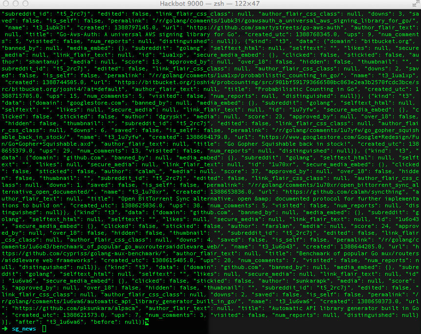
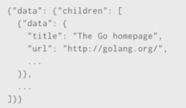
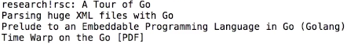
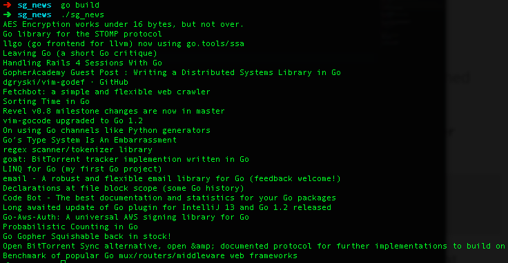

### Pre-Requisites

For this hack, we're going to use Reddit's API, SendGrid's API, and our Golang library for said API.  You can find the relevant libraries you require below:

* <a href="https://github.com/sendgrid/sendgrid-go">Go SendGrid Lib</a>

Other than those, we will be sticking to the excellent native libs from Go.

### Let's get started!

If you haven't already, head over to <a href="http://hack.sendgrid.com">hack.sendgrid.com</a>, register an account and hit me up on Twitter, @rbin, or by email Robin@SendGrid.com to get your account provisioned to send emails!

Once you've done that, use <i>Go Get</i> to install the dependencies above.  I.E.

	go get github.com/sendgrid/sendgrid-go
	

Now, go ahead and create a workspace / project for your hack.  Personally, I setup the namespace of <i>sg_news</i>, but you can use anything you like.  (Just make sure you alter the code I provide accordingly!)  So, we've installed our Dependencies, created a Project namespace and directory, so let's dive in a write some code!

Inside your News Reader namespace, create a file called ***main.go***  Open it up in your choice of IDE and input the following:

	package main

	import (
		"io"
		"log"
		"net/http"
		"os"
	)
	
	func main() {
	
		r, err := http.Get("http://reddit.com/r/golang.json")
		if err != nil {
			log.Fatal(err)
		}
	
		if r.StatusCode != http.StatusOK {
			log.Fatal(r.Status)
		}
	
		_, err = io.Copy(os.Stdout, r.Body)
		if err != nil {
			log.Fatal(err)
		}
	
	}
	  	
  	
Let's take a look at what we're doing here.  For now, in our import, we are just using native Go libraries.  We'll add in our other Dependencies in a short while.  As you can see, in our main() function, we are setting a variable ***"r"*** and doing a GET request to the Reddit API on our chosen Subreddit.  With the data we receive back, we are assigning it to our R variable.

In our Error Handling, we are ensuring we get a correct Status Code (200) when we issue the Get Request else we are going to use a Fatal Error including the Status Code received from the Reddit API, so we can diagnose any errors.

In the last code chunk, we are copying the r.Body (filled with the JSON received from the Reddit API) to the os.Stdout - r.Body being the ***writer*** value, and os.Stdout being the ***receiver*** value.  Obviously, we will be changing this shortly, but for now, go ahead and build your project and test it!

	>  go build
	
And then run it.

	>  ./sg_news

When you run your program, you should see something like the following:

As you can see, we are outputting (through os.Stdout) a huge blob of JSON that we received from the Golang Subreddit.  Although we can actually see the Articles inside there, this is no good to us.  We want to receive the Article's Title, a Link to the Article, and we want to assess the value of the article, based on the Reddit link Score the Article has received.  

So let's decode that JSON into native data structures, and make it beautiful enough so that we're proud to receive it in our inboxes each morning! 

### Structurally Integral!

To turn the JSON blob into a human readable format, we need to decode it into Native Data Types, as we mentioned above.  To do this, we're going to create 2 Structs.

The Reddit API returns a JSON response in the following format:

	
So we need to create our structs to account for this.  Luckily, Golang's native JSON package is ***very*** good.  By default, it will look to match field names when decoding a JSON object into a native data type (struct).  We can see Reddit's JSON return includes the fields "title" and "url", hence why we create our Struct as follows:

	type Item struct {
		Title string
		URL string
	}

	type Response struct {
		Data struct {
			Children []struct {
				Data Item
			}
		}
	}

Ok, so now let's modify our existing main() function, to Decode the Response into our Data Structure, instead of copying it to os.Stdout.  So, replace:

	_, err = io.Copy(os.Stdout, r.Body)
	if err != nil {
		log.Fatal(err)
	}

**With:**

	resp := new(Response)
	err = json.NewDecoder(r.Body).Decode(resp)

What we're doing here is initialising a new Response value, and storing a pointer to it in our newly assigned variable ***"resp"***.  We are then creating a new json.Decoder object and decoding the response body into ***"resp"***.

Now we've done that, we need to print the data.  To do this, we are going to create a FOR loop to iterate over the ***Children*** slice, assigning the slice value to ***"child"*** on each iteration.  Then we're going to print item's Title followed by a new line:

	for _, child := range resp.Data.Children {
		fmt.Println(child.Data.Title)
	}

Now, if we go ahead and build & run our project, we will see we get a list of article titles returned to us!

### It works! &nbsp; BUT we need more!

So we've got a single function program, that indeed works, but nowhere close to what we actually want.  At this point, alongside thinking about implementing the actual scheduled email (which we'll do last), we need to start thinking about making our program more extensible, more modular and more future-proof.  What about if a user wants to receive a different Subreddit for news?  Let's enable our user to choose which Subreddit to receive news from. 

So let's create a new func called ***"Get"*** and input the following into it:

	func Get(subreddit string) ([]Item, error) {

		url := fmt.Sprintf("http://reddit.com/r/%s.json", subreddit)
		r, err := http.Get(url)
		if err != nil {
			return nil, err
		}
	
		defer r.Body.Close()
		if r.StatusCode != http.StatusOK {
			return nil, errors.New(r.Status)
		}
	
		resp := new(Response)
		err = json.NewDecoder(r.Body).Decode(resp)
		if err != nil {
			return nil, err
		}
	
		items := make([]Item, len(resp.Data.Children))
		for i, child := range resp.Data.Children {
			items[i] = child.Data
		}
		return items, nil

	}

Our new Get function allows us to call the Reddit API request from anywhere in our Program, instead of only from our main() func.  We have swapped a fair amount of code out here, so let's break down what we've changed.

The func Get takes an argument called ***reddit*** that is a string.  It also returns an []Item slice and an error value (also a string.)  Now we have made our program more modular, our users can specify a Subreddit of their choice to be emailed updates each morning.  Our ***url*** var takes "reddit" as an argument from the function call.  This means when we call the ***Get*** func, we will specify which Subreddit to use.

Now that our program is taking place in more than just the main() func, we need to ensure we clean up any open TCP sockets opened by our program, once the function call has finished.

	defer r.Body.Close()
	
In this statement, we are shutting down the underlying TCP connection using the Close() function.  We use the **defer** function to clean up AFTER the HTTP request, and this call will only be executed after the function returns.

The ***items*** variable is creating a slice of "Items" (news articles), based on the size of how many articles are present.  We then use a for loop to iterate over the Items and assign each child's ***Data*** element to the corresponding element in the slice.

Finally, we return our items and a nil value to signify success.

### Calling *Get()* from *main()*

Now that we've added our Get() func, we need to modify our main() func to strip out duplicate content, but to also actually ***Call*** the Get() function.

Replace your current main() func with the following:

	func main() {

		items, err := Get("golang")
		if err != nil {
			log.Fatal(err)
		}
	
		for _, item := range items {
			fmt.Println(item.Title)
		}

	}

Note that *this* is where we are specifying which Subreddit to gather news from.  When we call the Get() func, we are passing an argument of "golang", but this could be the title from any Subreddit.  We are then ranging over each item in the Items slice, and printing the Item title.

So, if we Build and Run this now, we will be returned Articles from the Subreddit of our choice.  I have picked "golang" again, (as it's my favourite), Built & Run my program, and the results should look similar to this:

	

#### We're getting there, but we STILL need more.

It's nice that we have a working program, but only returning the Title of the Article is not much use to us.  We need to return more information about the Article for our Breakfast Email.  So to do this, we need to implement a formatted string that returns the Article Title and the Article URL.  To do this, we can use Go's built-in Stringer interface.  The Stringer interface allows us format User-Defined types, such as the ***"Item"*** type we're about to define to format our Subreddit results.

Let's define a String method to format our results:

	func (i Item) String() string {
		return fmt.Sprintf("%s\n%s", i.Title, i.URL)
	}

In this method, we use the Sprintf function to print the item Title, create a new line then print the item URL.  We'll change this a little later to return the URL as an actual link in our Email, alongside the title, and the Score.

Now we've implemented this, change your main() func to reflect this:

	for _, item := range items {
		fmt.Println(item)
	}
	

We now need to also receive the Score for each article.  We are using the Score as a safe bet as to the most popular articles.  
	
Let's update our ***"Item"*** struct to add in the Article Score.

	type Item struct {
		Title    string
		URL      string
		LinkScore int `json: "score"`
	}		

Remembering that Go naturally matches fields on title, it seems strange the we've called our field 'LinkScore' yet the field received from Reddit is 'score' no?  Well, our LinkScore field contains what is called a "struct tag", which is a string that annotates the field.  This tag:

	LinkScore int `json: "score"`
	
...Tells the JSON package to decode the "score" JSON field into our ***LinkScore*** field.  Now that we've got our Scores nailed, let's extend our Item String Method with a Switch statement to give us our nicely formatted links!

	func (i Item) String() string {
	
		com := ""
		switch i.LinkScore {
		case 0:
			// nothing
		case 1:
			com = " Score: 1"
		default:
			com = fmt.Sprintf(" (Score: %d)", i.LinkScore)
		}
		return fmt.Sprintf("
%s<b>%s</b>  <a href=\"%s\">%s</a>
", i.Title, com, i.URL, i.URL)
	
	}

## Let's get mailing!

Now we've got our Articles list formatted, and showing everything we want it to, let's set it up so that this information is emailed to us, every morning at 6am for us to read over breakfast!  As I said earlier, we're going to use the <a href="github.com/sendgrid/sendgrid-go">SendGrid-Go</a> lib for this.

In your Import statement, add in the following:

    "github.com/sendgrid/sendgrid-go"
    "bytes"

Then we can create an Email() func that we can call within our main() func to include the formatted Articles list inside the Email HTML body.  Create a function called Email() and have it reflect the following:

	func Email() string {

		var buffer bytes.Buffer
	
		items, err := Get("golang")
		if err != nil {
			log.Fatal(err)
		}
		// Need to build strings from items
		for _, item := range items {
			buffer.WriteString(item.String())
		}
	
		return buffer.String()
	}

What we're doing here is using the inbuilt bytes package to build strings from our items which we can then call from the Body section of our scheduled Email.  Let's revisit the main() function, and actually build the email we are going to send.

	func main() {
	
		sg := sendgrid.NewSendGridClient("sendgrid_user", "sendgrid_key")
		message := sendgrid.NewMail()
		
		message.AddTo("myemail@me.com")
		message.AddToName("Your Name")
		message.AddSubject("Your Daily Golang Breakfast News!")
		message.AddFrom("rbin@sendgrid.com")
	
		message.AddHTML(Email())
	
		if rep := sg.Send(message); rep == nil {
			fmt.Println("Email sent!")
			fmt.Println("Closing...")
		} else {
			fmt.Println(rep)
		}
	
	}

In the main() function, we are now preparing the email, that will be sent by the sendgrid-go library.  As you can see, we set various credentials that must be set to allow the email to be sent.  Our SendGrid username and key must be entered.  Your key can be found in your User settings.  

We set the AddTo value as the address we want to send the email to.   The AddToName value is the name of the person receiving the email then we set the Subject and From values (self explanatory).  The AddHTML value is normally used to enter HTML to compose the body of the email being sent out.  In our case, we are *Calling the Email()* function to input the list of Articles from the Golang Subreddit.

The final if statement is used to ensure that the email is sent.  And with that, we've got a fully operational News Reader that will email us a list of Golang Subreddit articles when run.  You can go ahead and 'go build' it and test it out to make sure.  But that's not it...

### Schedule the email!

So we've got a fully functional program, but the problem is, it will only email us our list of articles when we run the program manually.  To schedule the program to run every morning we have a couple of options.  We *could* leave the program running in the background, and use Go's time.Ticker library or similar to call the function at a specific time period.  The other option is to use a ***Cron Job*** to run the program periodically.  In this case we're going to use a Cron Job.

As this is such a small process, and takes only seconds to execute, it would be entirely pointless to leave the process running constantly, and have Go schedule the run.  In this case, it is a much better idea to simply have a Cron Job run the built, executable file every morning at 6am.  We can write a Cron Job to look similar to the following:

	0 6 * * * cd folder_containing_sg_news_executable && ./sg_news

We are telling our Cron Job to run at 0 minutes past the 6th hour (6am) every day here.  The Cron Job is changing into the directory in which our executable file is located, then simply running the program.

### And that's it!

To take a look at the my complete Go project, check out the <a href="https://github.com/rbin/sg_news">GitHub here.</a>

I realise this hack is a super simple piece of cake, but I hope it's a stepping stone in getting you started using SendGrid's Go library.  I also understand that this article has become rather long, so if you've read on thus far, thank you!

** 	- @rbin **